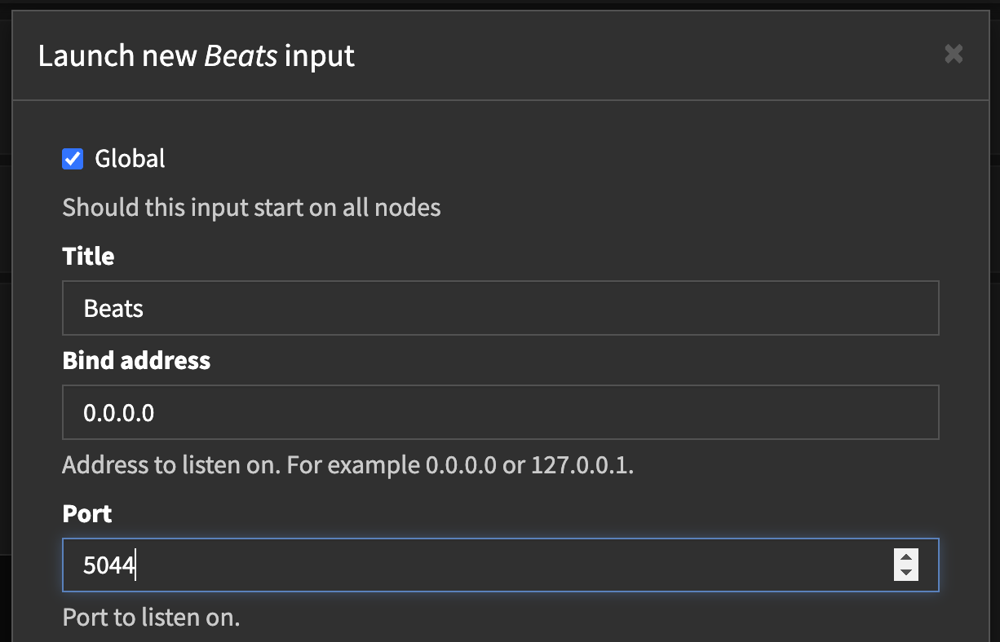

[Ondrej Sika (sika.io)](https://sika.io) | <ondrej@sika.io>

# Graylog Training

## Course

## Install using Docker Compose

```
git clone https://github.com/Graylog2/docker-compose graylog
```

```
cd graylog/open-core
```

Create `.env` file with following content:

```
echo GRAYLOG_PASSWORD_SECRET=aaaaaaaaaaaaaaaaaaaaaaaaaaaaaaaaaaaaaaaaaaaaaaaaaaaaaaaaaaaaaaaa >> .env
echo GRAYLOG_ROOT_PASSWORD_SHA2=ca978112ca1bbdcafac231b39a23dc4da786eff8147c4e72b9807785afee48bb >> .env
```

Increase `max_map_count` for OpenSearch:

```
sysctl -w vm.max_map_count=262144
```

```
docker-compose up -d
```

That's it. Graylog is running on http://graylog.sikademo.com:9000

See `docker compose logs` for initial password.

## Syslog TCP Input

- [Docs: Getting in Logs](https://go2docs.graylog.org/5-2/getting_in_log_data/getting_in_log_data.html)
- [Docs: Ingest Syslog](https://go2docs.graylog.org/5-0/getting_in_log_data/ingest_syslog.html)

Create Syslog TCP Input on port `5140` (System > Inputs > Select Input > Syslog TCP).

http://graylog.sikademo.com:9000/system/inputs


Install `rsyslogd`

```
apt install rsyslog
```

Create file `/etc/rsyslog.d/10-graylog.conf` with following content:

```
*.* @@graylog.sikademo.com:5140;RSYSLOG_SyslogProtocol23Format
```

Restart `rsyslogd`

```
systemctl restart rsyslog
```

See the logs in Graylog

## Beats Input

- [Docs: Getting in Logs](https://go2docs.graylog.org/5-2/getting_in_log_data/getting_in_log_data.html)
- [Docs: Beats](https://go2docs.graylog.org/5-0/getting_in_log_data/beats.html)

Create Beats Input on port `5044` (System > Inputs > Select Input > Beats).

http://graylog.sikademo.com:9000/system/inputs



Try example from `examples/filebeat`

```
cd examples/filebeat
```

```
make stdin-loggen
```

See the logs in Graylog

## Docker Logs Using Filebeat

Try Docker example from `examples/filebeat` on Linux machine.

```
cd examples/filebeat
```

```
make docker
```

## Install ECK

ECK (Elastic Cloud on Kubernetes) is operator for Kubernetes to run Elasticsearch, Kibana and APM Server.

- [Docs: Install ECK using the Helm chartedit](https://www.elastic.co/guide/en/cloud-on-k8s/current/k8s-install-helm.html)

```
helm install \
  elastic-operator \
  --repo https://helm.elastic.co \
  eck-operator \
  -n elastic-system \
  --create-namespace \
  --wait
```

## Filebeat in Kubernetes

See example in `examples/eck/filebeat`

Install ECK first (see above).

```
cd examples/eck/filebeat
```

```
kubectl apply -f .
```
